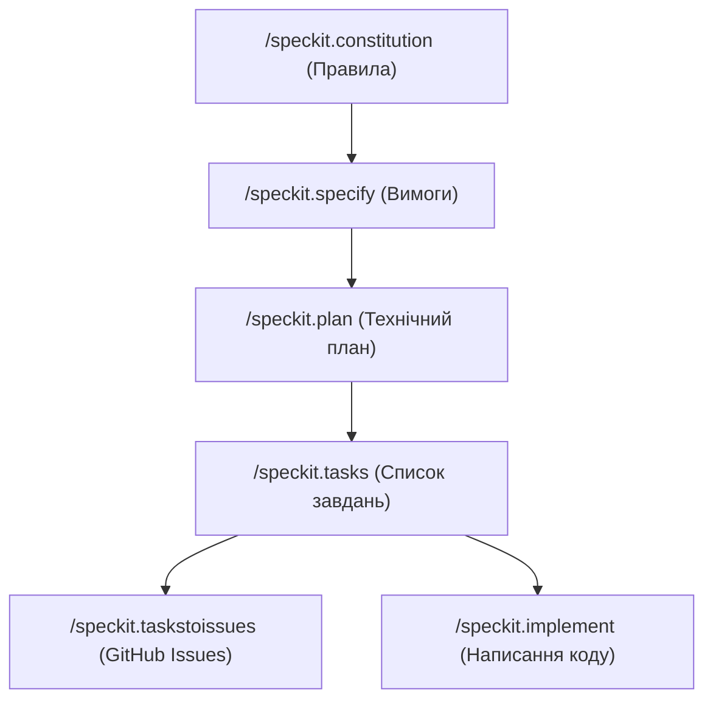

# GitHub Spec Kit: Посібник користувача (Quickstart Guide)

Ласкаво просимо до **Spec Kit** — інструментарію від GitHub для розробки на основі специфікацій (**Spec-Driven Development / SDD**). Цей посібник допоможе вам швидко розібратися з основними концепціями, командами та робочим процесом для ефективної роботи з ШІ-агентами кодування (зокрема з **Antigravity**).

---

## 🌟 Що таке Spec-Driven Development (SDD)?

**Spec-Driven Development (SDD)** — це методологія, що змінює підхід до розробки з "вайб-кодування" (vibe-coding), коли ШІ генерує код на основі нечітких інструкцій, на структурований процес, де головним джерелом істини є **специфікація**:

*   **Код служить специфікаціям**, а не навпаки.
*   Специфікація є живим артефактом під контролем версій (Git).
*   Будь-які зміни в продукті спочатку вносяться в специфікацію, після чого агент оновлює план, завдання та код.
*   Агенти стають взаємозамінними: оскільки специфікація чітка, ви можете використовувати будь-який інструмент (Antigravity, Claude Code, Copilot тощо).

---

## ⚙️ Встановлення та ініціалізація

Для роботи зі Spec Kit потрібен **Python 3.11+** та менеджер пакетів **uv** (встановлений на вашому ПК).

### 1. Встановлення CLI-інструменту `specify-cli`
Встановіть CLI глобально через `uv`:
```bash
uv tool install specify-cli --from git+https://github.com/github/spec-kit.git
```

### 2. Ініціалізація проекту
Перейдіть у каталог проекту та виконайте ініціалізацію для інтеграції з агентом **Antigravity** (`agy`):
```bash
specify init --here --integration agy --ignore-agent-tools
```

### 📁 Структура папок після ініціалізації:
*   `.specify/memory/constitution.md` — архітектурна "ДНК" проекту (незмінні правила).
*   `.specify/specs/` — ваші специфікації функцій (наприклад, `spec.md`).
*   `.specify/templates/` — шаблони для планів, завдань та специфікацій.
*   `.agents/skills/` — інтеграційні інструменти та команди для вашого ШІ-агента.
*   `AGENTS.md` — файл орієнтації для ШІ-агента.

---

## 🛠️ Шість основних команд робочого процесу

Процес розробки є лінійним. Кожна наступна фаза використовує артефакт попередньої фази:



1.  **`/speckit.constitution`**
    Встановлює невід'ємні керівні принципи проекту (стандарти тестування, архітектурні обмеження, правила UX). ШІ перевіряє цей файл на кожному етапі.
2.  **`/speckit.specify`**
    Фіксує бізнес-вимоги ("що" і "чому") у файлі `spec.md`. **Важливо:** на цьому етапі заборонено згадувати технологічний стек.
3.  **`/speckit.plan`**
    Створює технічний план реалізації (`plan.md`, `data-model.md`, `research.md`, `quickstart.md`) на основі обраного технологічного стеку.
4.  **`/speckit.tasks`**
    Розбиває план на впорядкований за залежностями список завдань (`tasks.md`) із маркерами паралельного виконання `[P]`.
5.  **`/speckit.taskstoissues`**
    Перетворює завдання з `tasks.md` на GitHub Issues для відстеження командою розробників.
6.  **`/speckit.implement`**
    Запускає автоматичне виконання завдань по порядку, створюючи або оновлюючи реальний код програми.

---

## 🔍 Додаткові команди контролю якості

Рекомендовано запускати ці команди на відповідних кроках для забезпечення стабільності:

*   **`/speckit.clarify`** (запускати перед плануванням) — ШІ ставить уточнювальні запитання щодо прогалин у специфікації, а відповіді записує в розділ `Clarifications`.
*   **`/speckit.analyze`** (запускати перед імплементацією) — перевіряє взаємну узгодженість файлів (специфікації, плану, моделі даних та завдань) на наявність суперечностей чи пропущених вимог.
*   **`/speckit.checklist`** (запускати після специфікації) — генерує та перевіряє контрольний список якості (своєрідні "модульні тести для мови вимог").

---

## 💡 Сценарії використання та межі

### Сценарії розробки:
1.  **Greenfield (Нові проекти)**: Повний цикл від Конституції до реалізації коду з нуля.
2.  **Brownfield (Існуючі бази)**: Створення нових функцій у підкаталогах `specs/` з урахуванням існуючої архітектури. Конституція визначається один раз.
3.  **Legacy (Модернізація)**: Опис логіки старої системи у специфікації для переписування без успадкування технічного боргу.

### ⚠️ Важливі обмеження:
*   **Не для дрібних багів**: Для виправлення помилок в один рядок повний цикл SDD є надмірним.
*   **Конституція та Специфікація мають бути живими**: Якщо ви не оновлюєте специфікацію при зміні коду, методологія втрачає сенс.
*   **Людина — останній щит**: ШІ може припуститися помилок у коді навіть за ідеального плану. Завжди проводьте ручне тестування та перевірку коду.
